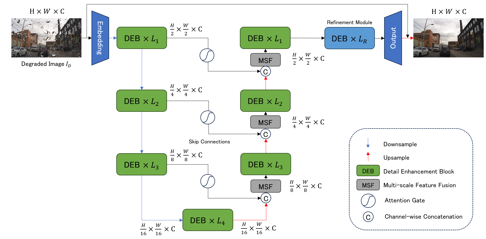
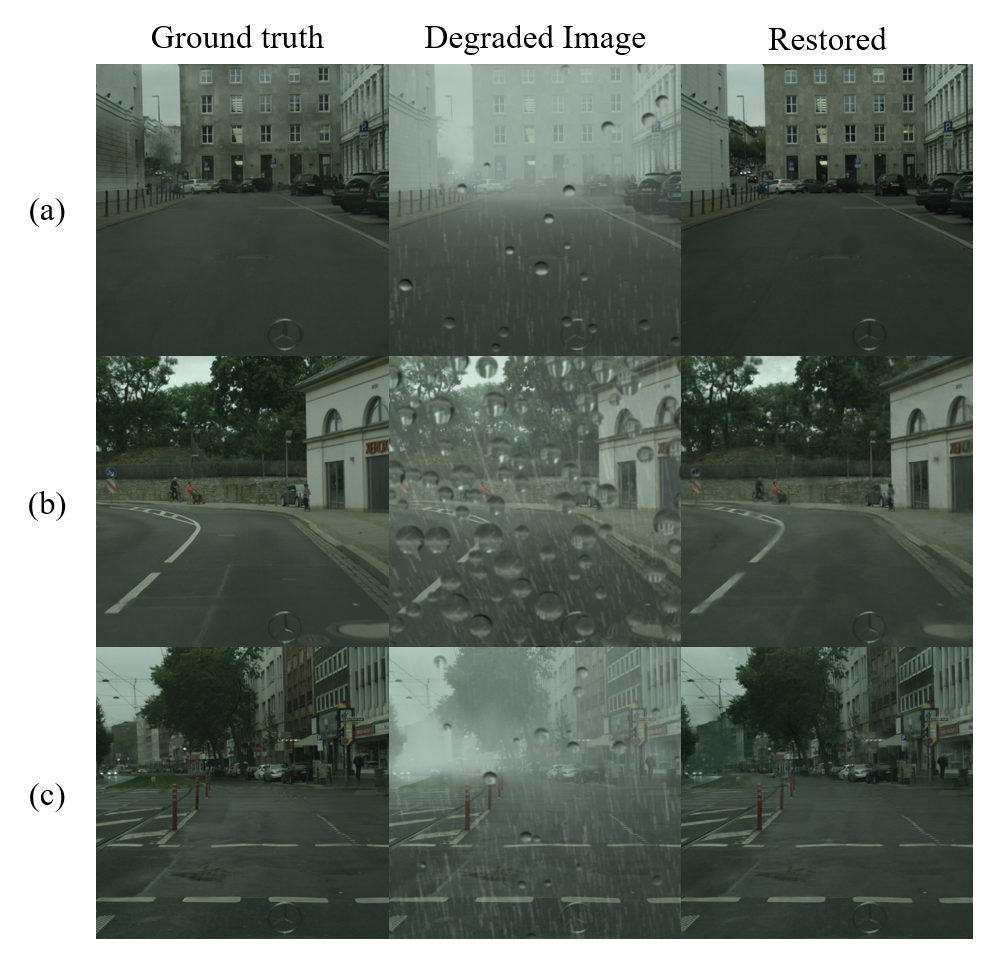

# AGEStormer

Code for my Master's thesis *Unified End-to-End Deraining Method of Driving Images Under Multiple Rain Conditions*

## Abstract
With the rapid advancement of autonomous driving technology, vision-based perception systems play a critical role in ensuring driving safety and reliability. However, adverse weather conditions, particularly the complex degradations caused by rainy weather, such as rain streaks, raindrops, and fog, significantly compromise sensor imaging quality and threaten driving safety. Efficient and accurate removal of these degradations is crucial to enhancing the robustness and reliability of autonomous driving systems.

We propose AGEstormer, an end-to-end attention-driven transformer encoder-decoder network designed to address diverse rain degradations, including rain streaks, raindrops, and fog. By incorporating specially designed Detail Enhancement Transformer Blocks (DEB), Spatial-Attention-Gated Skip Connections, and a refinement module before the final output layer, AGEstormer effectively handles single and multiple degradations while preserving fine-grained texture details.

We also constructed a large-scale synthetic driving image dataset named RDScityscapes to support model training and evaluation. We utilized the ray tracing method to simulate realistic adherent raindrops on the windshield from a driving perspective. This dataset includes 9,432 training image pairs and 1,188 testing pairs, comprising photo-realistically rendered rain streaks, raindrops, fog, and their combinations. We also include raindrop binary masks for extra information.

Experiments on multiple open-source datasets and the RDScityscapes dataset demonstrate that AGEstormer excels in individual rain streak and raindrop removal tasks and outperforms existing models when addressing multiple overlapping degradations. Additionally, tests on real-world raindrop datasets indicate that AGEstormer possesses the capability to handle the dispersed distribution of real-world rain degradations.

The results of this study represent an important step toward the practical application of models with more robustness in recovering degraded driving images, thereby contributing to the realization of more reliable automatic driving assistance systems.

__Note: This code base is still not arranged yet. The model details can be found in this code-base. Feel free to  run it with your train/eval file.__

